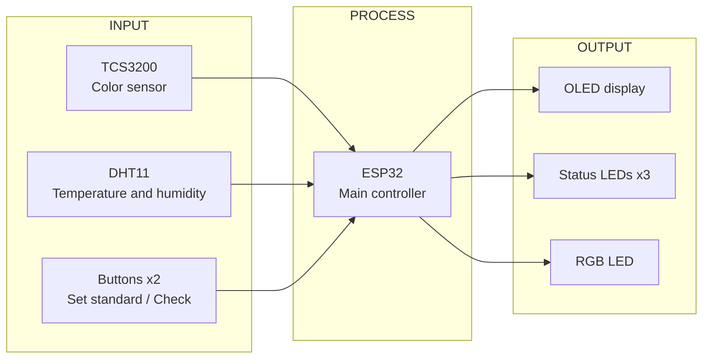
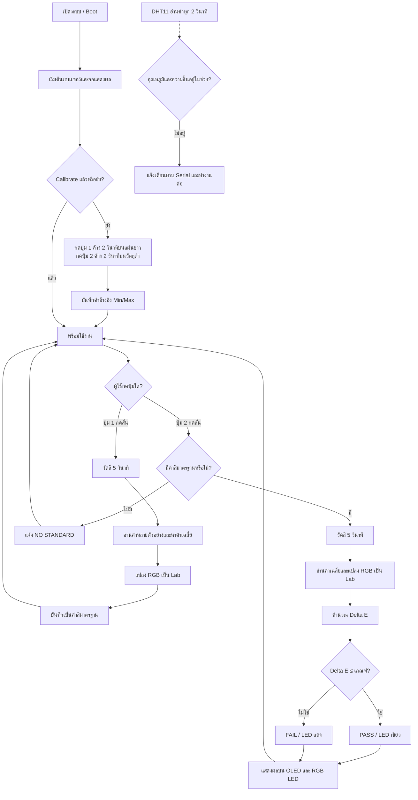

# Smart Color Sorting

ระบบตรวจสอบสีวัตถุด้วย ESP32 และเซนเซอร์ TCS3200 เปรียบเทียบสีที่วัดได้กับค่าสีมาตรฐาน พร้อมตรวจวัดอุณหภูมิและความชื้นด้วย DHT11 และแสดงผลผ่านจอ OLED กับ LED

## ภาพอุปกรณ์จริง


## อุปกรณ์

| อุปกรณ์ | บทบาท |
|---|---|
| ESP32 | หน่วยประมวลผลหลัก |
| TCS3200 | เซนเซอร์ตรวจจับสี RGB |
| DHT11 | วัดอุณหภูมิและความชื้นแวดล้อม |
| SSD1306 OLED | แสดงสถานะและผลการวัด |
| LED เขียว/เหลือง/แดง | แสดงผลผ่าน/กำลังวัด/ไม่ผ่าน |
| RGB LED | แสดงสีที่วัดได้ |
| ปุ่มกด 2 ปุ่ม | ตั้งค่าสีมาตรฐาน ตรวจสี และ calibrate |

## Block Diagram



## Circuit Diagram


## Pin Mapping

| อุปกรณ์ | ขาอุปกรณ์ | ESP32 GPIO | หมายเหตุ |
|---|---|---:|---|
| TCS3200 | S0 | 32 | Output |
| TCS3200 | S1 | 33 | Output |
| TCS3200 | S2 | 25 | Output |
| TCS3200 | S3 | 26 | Output |
| TCS3200 | OUT | 34 | Input only |
| TCS3200 | LED | 2 | Optional; strapping pin |
| DHT11 | DATA | 4 | Digital I/O |
| SSD1306 (I2C) | SDA | 21 | I2C |
| SSD1306 (I2C) | SCL | 22 | I2C |
| ปุ่ม 1 (Set standard / Calibrate white) | — | 18 | `INPUT_PULLUP` |
| ปุ่ม 2 (Check color / Calibrate black) | — | 19 | `INPUT_PULLUP` |
| LED เขียว (ผ่าน) | — | 13 | ต่อผ่านตัวต้านทาน 330 Ω |
| LED เหลือง (กำลังประมวลผล) | — | 14 | ต่อผ่านตัวต้านทาน 330 Ω |
| LED แดง (ไม่ผ่าน) | — | 27 | ต่อผ่านตัวต้านทาน 330 Ω |
| RGB LED | R | 5 | ต่อผ่านตัวต้านทาน 1 kΩ |
| RGB LED | G | 23 | ต่อผ่านตัวต้านทาน 1 kΩ |
| RGB LED | B | 15 | Strapping pin; ต่อผ่านตัวต้านทาน 1 kΩ |

> **หมายเหตุ:** GPIO 2 และ GPIO 15 เป็น strapping pins และอาจมีผลต่อโหมด Boot/Download ขณะอัปโหลดโค้ด หากพบข้อผิดพลาด `Wrong boot mode` ให้ถอดสายที่ต่อกับขาเหล่านี้ชั่วคราวระหว่างอัปโหลด

## ซอร์สโค้ด

ซอร์สโค้ดหลักอยู่ที่ [`src/main.cpp`](./src/main.cpp) (เมื่อเพิ่มไฟล์ดังกล่าวในโปรเจกต์)

## วิธีใช้งาน

### 1. Calibrate เซนเซอร์

ก่อนใช้งาน ให้เตรียมแผ่นอ้างอิงสีขาวและวัตถุสีดำ เพื่อกำหนดช่วงค่าความถี่ของ TCS3200 สำหรับแปลงเป็น RGB ช่วง 0–255

1. วางแผ่นสีขาวหน้าเซนเซอร์ แล้วกดปุ่ม 1 ค้าง 2 วินาที เพื่อบันทึก white reference
2. วางวัตถุสีดำหน้าเซนเซอร์ แล้วกดปุ่ม 2 ค้าง 2 วินาที เพื่อบันทึก black reference
3. เมื่อ calibrate ครบ จอ OLED จะแสดง `Calibrated! Ready to use`

### 2. ตั้งค่าสีมาตรฐาน

กดปุ่ม 1 สั้น ๆ เพื่อวัดวัตถุอ้างอิงเป็นเวลา 5 วินาที ระบบอ่านค่าจาก TCS3200 หลายตัวอย่าง หาค่าเฉลี่ย แปลงค่าความถี่เป็น RGB แล้วแปลง RGB เป็น CIE XYZ และ CIE L\*a\*b\* (D65) เพื่อเก็บเป็นค่าสีมาตรฐาน

### 3. ตรวจสอบสี

กดปุ่ม 2 สั้น ๆ เพื่อวัดวัตถุที่ต้องการตรวจเป็นเวลา 5 วินาที ระบบคำนวณสีในรูปแบบ L\*a\*b\* แล้วเปรียบเทียบกับค่าสีมาตรฐานด้วยค่า Delta E (CIE76):

```text
ΔE = √[(L₂ − L₁)² + (a₂ − a₁)² + (b₂ − b₁)²]
```

ค่าเกณฑ์เริ่มต้นคือ 5.0: หาก ΔE ≤ เกณฑ์ จะแสดง **PASS**; หากมากกว่าเกณฑ์ จะแสดง **FAIL**

## การทำงานของระบบ

- DHT11 อ่านค่าอุณหภูมิและความชื้นทุก 2 วินาที หากอุณหภูมิอยู่นอกช่วง 20–25 °C หรือความชื้นอยู่นอกช่วง 50–60% ระบบแจ้งเตือนผ่าน Serial แต่ยังทำงานตรวจสีต่อ
- LED เหลืองกะพริบระหว่างวัดสี 5 วินาที
- LED เขียวหรือแดงแสดงผล PASS หรือ FAIL หลังวัดเสร็จ
- RGB LED แสดงสีที่วัดได้หลังการวัด โดยใช้ PWM

## Flowchart



## วิดีโอและเอกสารประกอบ

- [วิดีโอสาธิตการทำงาน](https://drive.google.com/file/d/1pIEfAaHEV0aG9H365E0cTfveZoBYNHf0/view?usp=sharing)
- [โฟลเดอร์เอกสารและวิดีโอที่เกี่ยวข้อง](https://drive.google.com/drive/folders/1cYNA5aBpP_1kcFingMsXloWdOxsch5ff?usp=sharing)

## ไฟล์นำเสนอ

ลิงก์ดาวน์โหลดไฟล์สไลด์และคลิปนำเสนอยังไม่ได้ระบุ
