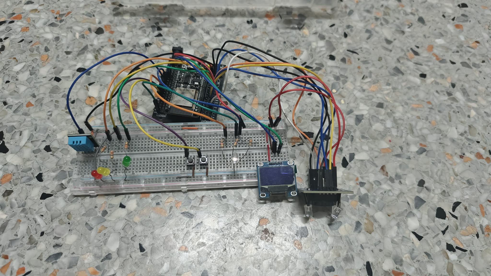
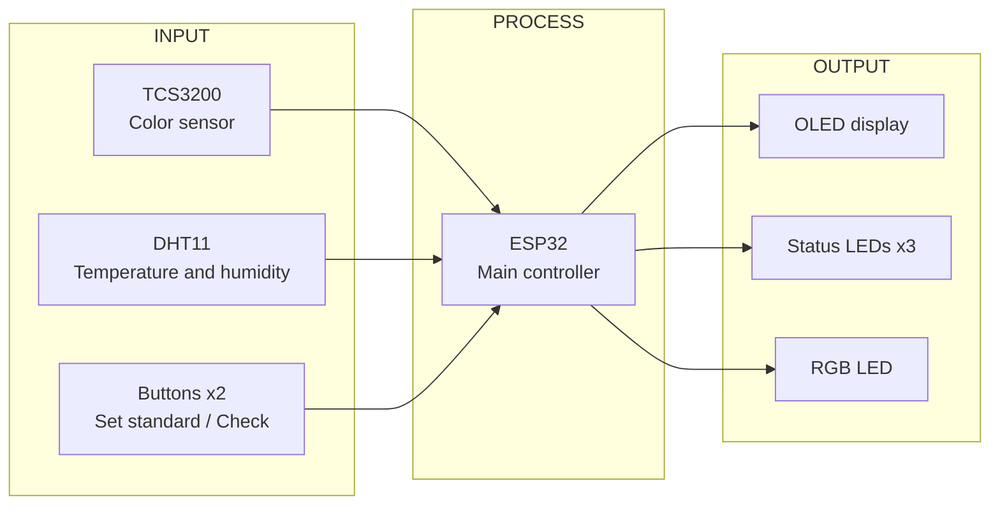
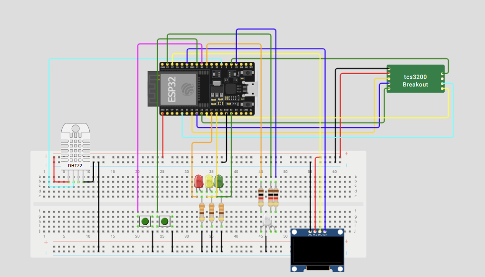
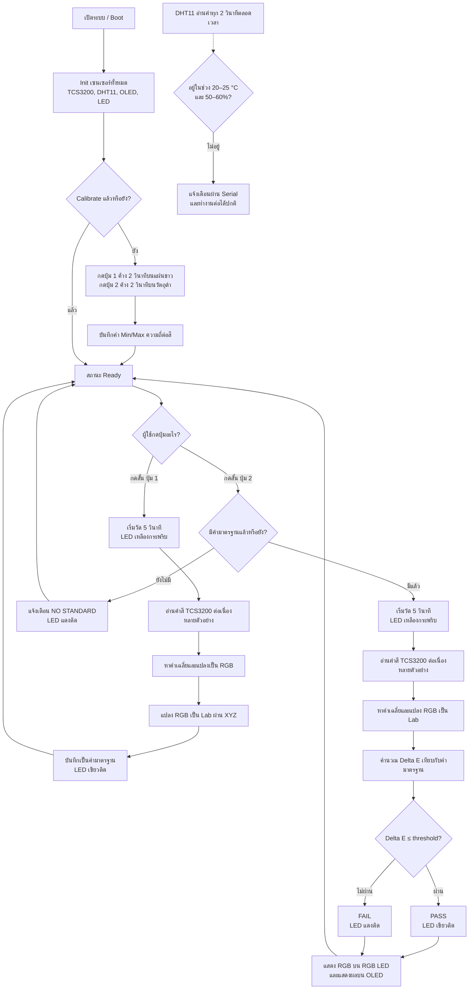

# Smart Color Sorting

## 1) Project Title and Overview

**ชื่อโครงงาน:** Smart Color Sorting

ระบบวัดสีของวัตถุแล้วเปรียบเทียบกับค่าสีมาตรฐานที่ผู้ใช้บันทึกไว้ โดยแปลงค่าสีเป็น CIE L\*a\*b\* และคำนวณ Delta E (CIE76) เพื่อตัดสิน PASS/FAIL นอกจากนี้ระบบอ่านอุณหภูมิและความชื้นด้วย DHT11 และแสดงสถานะผ่าน OLED, LED แสดงผล และ RGB LED

ระบบประกอบด้วย 3 ส่วนหลัก: รับข้อมูลจาก TCS3200, DHT11 และปุ่มกด; ประมวลผลบน ESP32; และแสดงผลผ่าน SSD1306 OLED, LED สถานะ 3 สี และ RGB LED การวัดสีและอ่านสภาพแวดล้อมทำงานคู่ขนานโดยไม่หยุดรอการทำงานส่วนอื่น

โครงงานนี้ใช้ ESP32 และ TCS3200 ตรวจสอบว่าสีของวัตถุตรงกับสีมาตรฐานหรือไม่ ผู้ใช้ calibrate เซนเซอร์ด้วยแผ่นสีขาวและวัตถุสีดำ ตั้งค่าสีมาตรฐาน แล้วตรวจวัตถุชิ้นอื่น ระบบประเมินความแตกต่างของสีด้วย Delta E (CIE76) โดยค่าเริ่มต้นกำหนดเกณฑ์ไว้ที่ 5.0 พร้อมตรวจสอบอุณหภูมิ/ความชื้นและแสดงผลบนอุปกรณ์

### อุปกรณ์ที่ใช้

| อุปกรณ์ | บทบาท |
|---|---|
| ESP32 | หน่วยประมวลผลหลัก |
| TCS3200 | เซนเซอร์ตรวจจับสี RGB |
| DHT11 | วัดอุณหภูมิและความชื้นของสภาพแวดล้อม |
| SSD1306 OLED | แสดงสถานะและผลการวัด |
| LED เขียว/เหลือง/แดง | แสดงผลผ่าน/กำลังประมวลผล/ไม่ผ่าน |
| RGB LED | แสดงสีที่วัดได้จริง |
| ปุ่มกด 2 ปุ่ม | ตั้งค่าสีมาตรฐาน ตรวจสี และ calibrate |

## 2) Picture of Actual Hardware



## 3) Block Diagram and Circuit Diagram

### Block Diagram (Input → Process → Output)



### Circuit Diagram



### ตารางกำหนดขา (Pin Mapping)

| อุปกรณ์ | ขาอุปกรณ์ | ESP32 GPIO | หมายเหตุ |
|---|---|---:|---|
| TCS3200 | S0 | 32 | Output |
| TCS3200 | S1 | 33 | Output |
| TCS3200 | S2 | 25 | Output |
| TCS3200 | S3 | 26 | Output |
| TCS3200 | OUT | 34 | Input only |
| TCS3200 | LED | 2 | Optional; strapping pin |
| DHT11 | DATA | 4 | Digital I/O |
| SSD1306 (I2C) | SDA | 21 | I2C มาตรฐาน |
| SSD1306 (I2C) | SCL | 22 | I2C มาตรฐาน |
| ปุ่ม 1 (Set standard / Calibrate white) | — | 18 | `INPUT_PULLUP` |
| ปุ่ม 2 (Check color / Calibrate black) | — | 19 | `INPUT_PULLUP` |
| LED เขียว (ผ่าน) | — | 13 | ต่อผ่านตัวต้านทาน 330 Ω |
| LED เหลือง (ประมวลผล) | — | 14 | ต่อผ่านตัวต้านทาน 330 Ω |
| LED แดง (ไม่ผ่าน) | — | 27 | ต่อผ่านตัวต้านทาน 330 Ω |
| RGB LED | R | 5 | ต่อผ่านตัวต้านทาน 1 kΩ |
| RGB LED | G | 23 | ต่อผ่านตัวต้านทาน 1 kΩ |
| RGB LED | B | 15 | Strapping pin; ต่อผ่านตัวต้านทาน 1 kΩ |

> **หมายเหตุ:** GPIO 2 และ GPIO 15 เป็น strapping pins ซึ่งอาจมีผลต่อ Boot/Download Mode ขณะอัปโหลดโค้ด หากพบ `Wrong boot mode` ให้ถอดสายที่ต่อกับขาเหล่านี้ชั่วคราวระหว่างอัปโหลด

### Datasheets

รวม datasheets ของอุปกรณ์ทั้งหมดไว้ใน [โฟลเดอร์ Datasheets บน Google Drive](https://drive.google.com/drive/folders/1gYvXKTo-X0JG-hFTFxcEkIS98EZXfIoH?usp=sharing)

## 4) Codes — Source Code and Versions

ซอร์สโค้ดมี 2 เวอร์ชัน โดย Version 1 อยู่ใน branch `version1` และ Version 2 เป็นเวอร์ชันหลักที่อยู่ใน branch `main` ของ GitHub repository

| เวอร์ชัน | รายละเอียด |
|---|---|
| [Version 1](https://github.com/Ogasu/smart-color-sorter-esp32/tree/version1) | ซอร์สโค้ดใน branch `version1` |
| [Version 2](https://github.com/Ogasu/smart-color-sorter-esp32/tree/main) | เวอร์ชันหลักใน branch `main` |

## 5) Demonstration VDO

วิดีโอสาธิตการทำงานและทดสอบระบบจริง:

- [คลิกเพื่อรับชมวิดีโอสาธิตการทำงาน](https://drive.google.com/file/d/1pIEfAaHEV0aG9H365E0cTfveZoBYNHf0/view?usp=sharing)
- [โฟลเดอร์เอกสารและวิดีโอที่เกี่ยวข้อง](https://drive.google.com/drive/folders/1cYNA5aBpP_1kcFingMsXloWdOxsch5ff?usp=sharing)

## 6) Manual Report — อธิบายงานและการใช้งาน

### ภาพรวมกระบวนการ

การวัดสีและตรวจอุณหภูมิ/ความชื้นทำงานคู่ขนานแบบ non-blocking ไม่มีขั้นตอนใดค้างรอจนระบบส่วนอื่นหยุดทำงาน

### 6.1 การตั้งค่าเริ่มต้น (Calibration)

ก่อนใช้งานจริง ให้ calibrate TCS3200 ด้วยวัตถุอ้างอิง 2 ชิ้น คือแผ่นสีขาวและวัตถุสีดำ เพื่อให้ระบบกำหนดขอบเขตความถี่สูงสุด/ต่ำสุดก่อนแปลงเป็น RGB ช่วง 0–255

1. วางแผ่นสีขาวหน้าเซนเซอร์ แล้วกดปุ่ม 1 ค้าง 2 วินาที เพื่อบันทึก white reference (ค่าความถี่ต่ำสุด)
2. วางวัตถุสีดำหน้าเซนเซอร์ แล้วกดปุ่ม 2 ค้าง 2 วินาที เพื่อบันทึก black reference (ค่าความถี่สูงสุด)
3. เมื่อ calibrate ครบทั้งคู่ จอ OLED จะแสดง `Calibrated! Ready to use`

### 6.2 การตั้งค่าสีมาตรฐาน (Set Standard)

กดปุ่ม 1 แบบสั้นเพื่อวัดสีวัตถุอ้างอิงเป็นเวลา 5 วินาที ระบบอ่านค่าความถี่จาก TCS3200 ต่อเนื่องหลายตัวอย่างแล้วหาค่าเฉลี่ย จากนั้นแปลงความถี่เป็น RGB (0–255), แปลง RGB เป็น CIE XYZ และแปลงต่อเป็น CIE L\*a\*b\* ตามมาตรฐาน D65 เพื่อบันทึกเป็นค่าสีมาตรฐาน

### 6.3 การตรวจสอบสี (Check Color)

กดปุ่ม 2 แบบสั้นเพื่อวัดสีวัตถุที่ต้องการตรวจเป็นเวลา 5 วินาที ระบบแปลงค่าที่วัดได้เป็น L\*a\*b\* แล้วคำนวณ Delta E (CIE76) ซึ่งเป็นระยะห่างระหว่างสีกับค่าสีมาตรฐาน:

```text
ΔE = √[(L₂ − L₁)² + (a₂ − a₁)² + (b₂ − b₁)²]
```

ค่าเกณฑ์เริ่มต้นคือ 5.0: เมื่อ ΔE ≤ เกณฑ์ ระบบแสดง **PASS**; เมื่อ ΔE มากกว่าเกณฑ์ ระบบแสดง **FAIL** หากยังไม่มีค่าสีมาตรฐาน ระบบจะแจ้ง `NO STANDARD`

### 6.4 ระบบย่อยและการแสดงผล

- DHT11 อ่านค่าทุก 2 วินาที เพื่อตรวจว่าอุณหภูมิอยู่ในช่วง 20–25 °C และความชื้นอยู่ในช่วง 50–60% หรือไม่ หากอยู่นอกช่วงจะแจ้งเตือนผ่าน Serial แต่ไม่หยุดการทำงานของระบบ
- LED เหลืองกะพริบตลอดช่วงวัดค่า 5 วินาที
- LED เขียวหรือแดงติดค้างหลังวัดเสร็จเพื่อแสดงผลผ่าน/ไม่ผ่าน
- RGB LED แสดงสีจริงที่วัดได้หลังวัดเสร็จ โดยใช้ PWM ผสมสี
- OLED แสดงสถานะและผลการวัด

### Flowchart การทำงาน



## 7) Presentation File — Original and PDF

ไฟล์นำเสนอควรมีทั้งต้นฉบับและ PDF และไม่ใส่รูปสมาชิกกลุ่มตามข้อกำหนด ข้อมูลที่ได้รับยังไม่มีลิงก์หรือไฟล์สำหรับดาวน์โหลด:

- ต้นฉบับ (.pptx): (https://docs.google.com/presentation/d/15MikGI1bbQ0WIG2MSrVcMAaPz9odXQD4/edit?usp=sharing&ouid=110563105517118660735&rtpof=true&sd=true)
- PDF (.pdf): (https://drive.google.com/file/d/1a5M5IKkqirkl2Xb76qBO_1syzHdgb5sb/view?usp=sharing)

## 8) Presentation Clip

- ต้นฉบับ (6 min): (https://drive.google.com/file/d/1BLFLzZQdKjyTYjYfweshApopKfx2awWu/view?usp=sharing)
- คลิปเต็ม (8 min): (https://drive.google.com/file/d/1BLFLzZQdKjyTYjYfweshApopKfx2awWu/view?usp=sharing)
